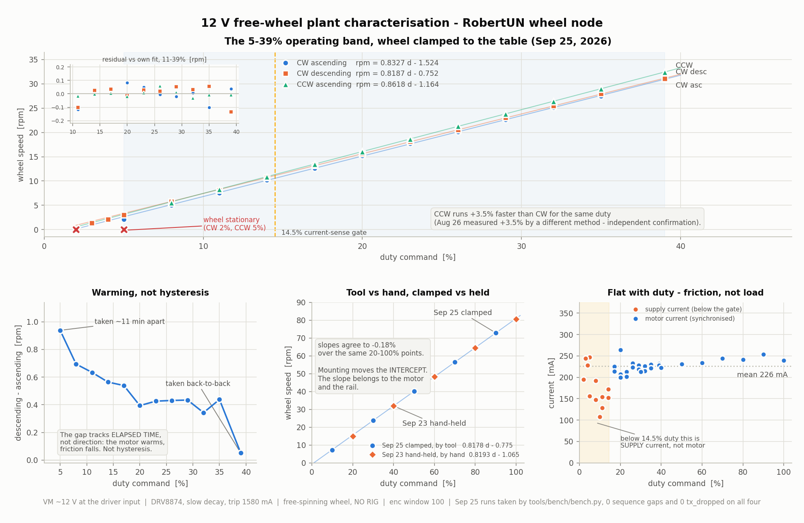
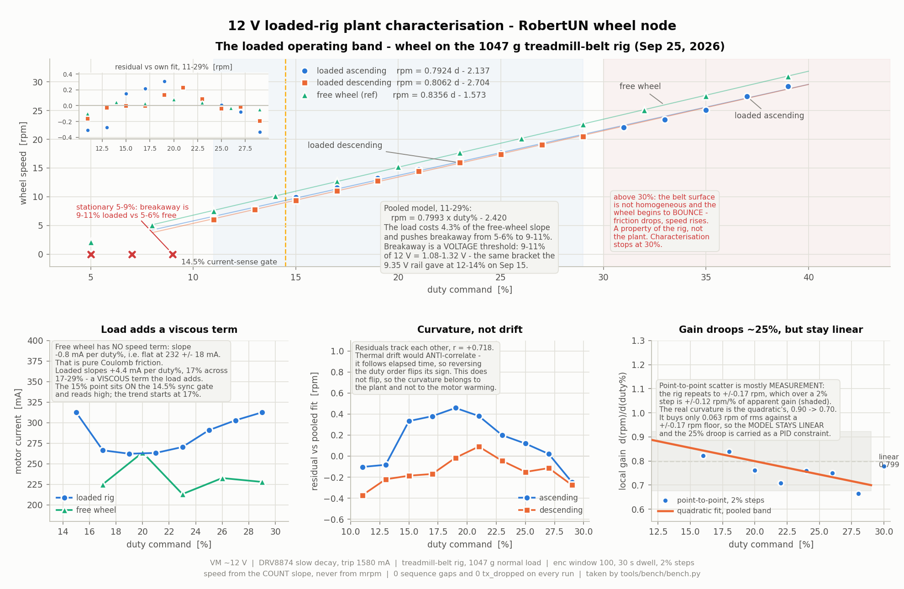
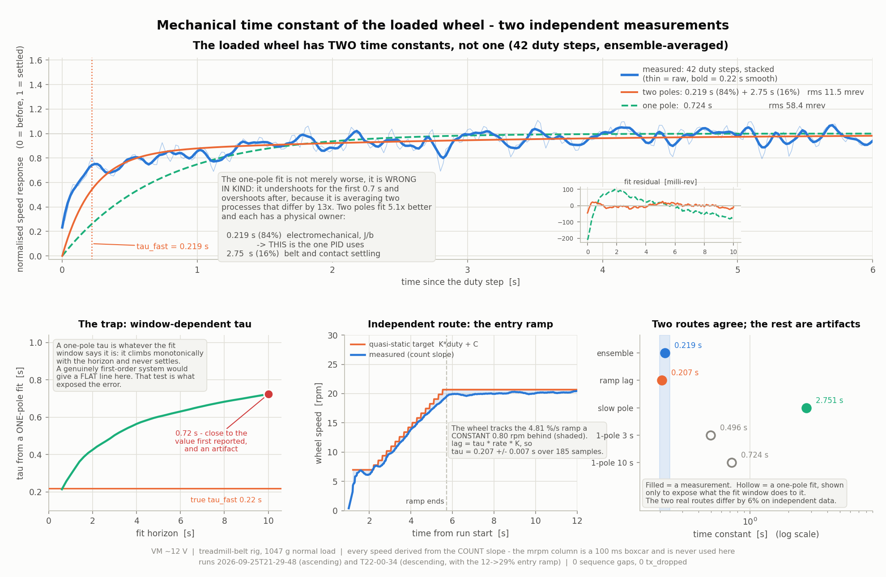
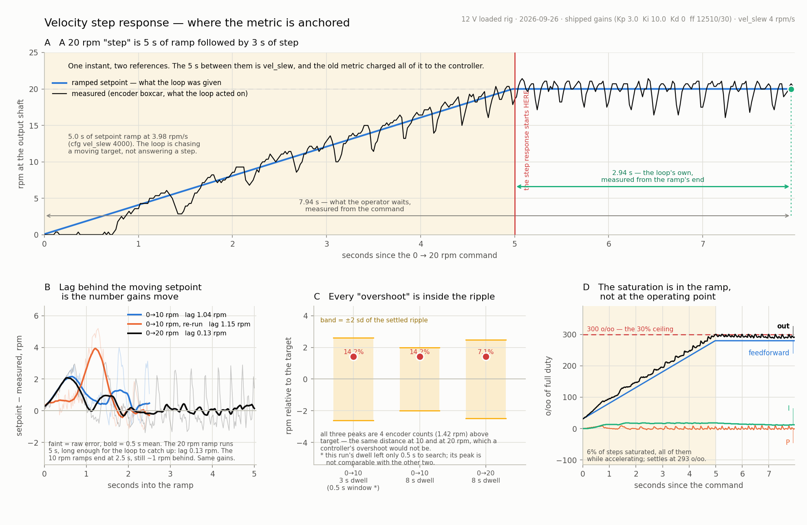
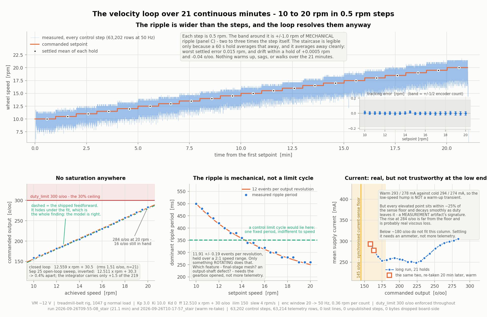
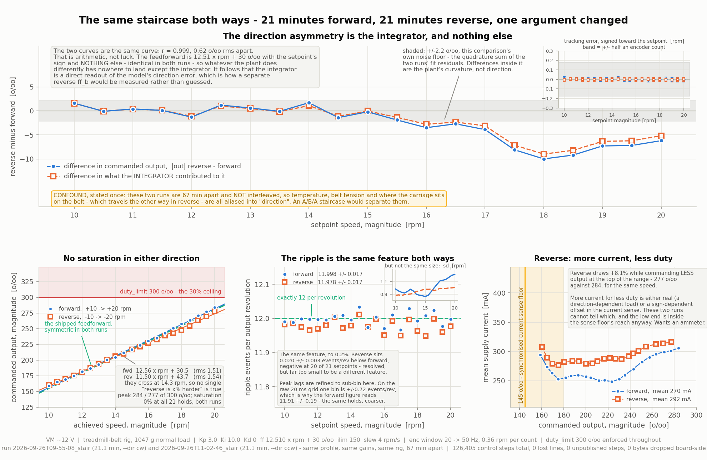

# RobertUN wheel firmware — reference: tasks — open and in progress

> Reference tier. Moved verbatim from `PROJECT_CONTEXT_WHEEL_FW.md` on 2026-09-26.
> Do not read whole: `grep -n '^#' <this file>` and read the section you need.
> Contents: full text of every open task; closed tasks move to the LOG file

## NEXT TASKS — wheel firmware track

(Original numbering preserved for cross-reference with PROJECT_CONTEXT_REST.md)

### Task 6 — CAN bus — STM32 firmware (W2 done; RX decision open)

6. **CAN Bus — STM32 firmware:** ✅ **COMPLETED August 10, 2026** (roadmap W2).
   250 kbps bxCAN, accept-all filter on bank 0, DMA console, loopback self-test,
   termination measured 59.79R, three-way verification against Orion `candump`
   and the CANable with zero error counters. Full detail in the LOG file.
   - Open, non-blocking: `cmd_errors` ESR snapshot (see Known issue above)
   - **Open decision:** polled vs interrupt-driven CAN RX — the Aug 11 load ramp
     bounds throughput only, not latency. Hybrid ISR-to-ring is the leading
     candidate. Settle before W6.

### Task 17 — Motor rail 9.5 V → 12 V and the 12 V plant

17. **Motor rail 9.5 V → 12 V (decided Sep 12, 2026)**

    ❌ **INVALID — measured before Sep 20, when PMODE was wrong (stated Sep 27).**
    Everything from here to the Sep 25 re-measure bullet that rests on a
    pre-Sep-20 measurement — the 9.35 V history, the "What changes" table,
    R_w / V_brush / L, both stall currents, the deadbands and the Sep 19 DMM
    VM reading — is history only. Valid 12 V figures start Sep 21. VM re-read
    12.02 V on Sep 27.

    The motor is a **6 V / 12 V** unit run at **9.35 V at the terminals** since
    Aug 26. That figure exists only because the DRV8833 could not exceed 10.8 V.
    The architecture does not change: the **per-motor step-down on each node
    PCB stays**, fed independently from the >13.5 V rail — only its output
    set-point moves from 9.5 V to 12 V.

    **What changes** (R_w 1.87 Ω, V_brush 0.14 V, L 1.70 mH — electrical
    properties, unchanged by the supply):

    | | 9.35 V (now) | 12 V |
    |---|---|---|
    | No-load output speed | ~60 rpm | **~76 rpm** |
    | Stall current, datasheet | — | 5.5 A |
    | Stall current, measured cold | 5.0 A | **6.3 A** |
    | Deadband (slow decay) | ~2.6% duty | ~2.0% duty |
    | Supply draw at a regulated 5 A stall | — | ~3.9 A |

    **On the two stall figures.** The datasheet says 5.5 A at 12 V (implying
    2.18 Ω); the Aug 25 bench work on two motors, cross-checked three ways,
    gives 1.87 Ω + 0.14 V of brush drop, i.e. 6.3 A. These are not in conflict —
    copper rises ~0.39%/°C, so a winding hot from stalling reads ~15% higher
    resistance than the cold one that was measured. **5.5 A is the settled
    figure; 6.3 A is the first instant.** Since every start from rest draws
    stall current momentarily, the cold number is the one the driver sees.

    **RAIL RAISED Sep 19, 2026 — 12.0 V measured with a DMM at the DRV8874's
    VM pin.** That is the authoritative figure; the oscilloscope read ~12.4 V on
    the driven output and the ~0.4 V difference is scope ADC accuracy.

    - ⚠️ **The trip cannot be set anywhere near stall — by a factor of four.**
      With `k = 3` and the measured constants the maximum is **~1580 mA**
      against a cold stall of **~6.3 A** (❌ pre-Sep-20 figure, invalid). The boot default is now **1000 mA**,
      written as the figure it always physically was. This fails safe
      (trip-limited, never over-current) but it means **every stall or high-duty
      figure is a property of the trip, not of the motor** — and there is no
      longer any "park the trip high first" escape, because the ceiling itself
      is below stall. Reaching a stall-relevant trip needs a smaller `R_IPROPI`
      and costs ADC resolution — an HW1 decision, see the IPROPI section.
    - ⬜ **Meter the MOTOR TERMINALS, not just VM.** 12.0 V at the driver input
      is not 12 V at the motor: there is ~0.10 V of harness drop at light load
      and more under current, so the terminal figure is still unmeasured and
      will read lower. The 9.45 V → 9.35 V measurement is the precedent, and the
      terminal number is the one the plant model needs.
    - Note (closed Sep 27, not a task) — the 5.5 A bench-supply limit **needs no change**: in slow decay the
      supply sees `I_motor × D`, so even a regulated 5 A stall draws ~3.9 A.
    - Note (closed Sep 27, not a task) — **Peak torque will be trip-limited, not voltage-limited.** Torque ∝
      current, so capping current at 5 A caps stall torque at roughly what
      9.5 V already gave. The real gain from 12 V is **speed, and torque at
      speed** — more voltage headroom to drive current against back-EMF, which
      shifts the whole torque-speed curve out. Worth being explicit about so
      nobody expects a bigger stall number.
    - ✅ **Re-measure the plant at 12 V — COMPLETE Sep 25, 2026, FREE WHEEL
      AND LOADED RIG BOTH.** CW, CCW, full range and the operating band on the
      free wheel; then the loaded-rig pass at 1047 g, plus the plant's two-pole
      time constant. The rail
      moved on Sep 19, so `rpm = 0.672 × duty% − 1.8`, the ~2.6% deadband,
      breakaway, dropout and the 4.9 rpm minimum sustainable speed are all
      figures for a rail that no longer exists (❌ and pre-Sep-20, invalid). R, L and Ke carry over; the
      duty→speed and duty→current mappings do not. Gains tuned at one rail do
      not transfer.

      ✅ **CW sweep DONE Sep 23** — free-spinning **wheel on the shaft** (not the
      bare shaft of the Aug 26 table, and not the loaded rig), VM 12.03 V, trip
      999 mA, slow decay, two reads per point:

      | duty % | rpm | Imotor mA |
      |---|---|---|
      | 20 | 15.00 | 178 / 236 |
      | 40 | 31.95 | 151 / 188 |
      | 60 | 48.38 | 237 / 190 |
      | 80 | 64.44 | 253 / 246 |
      | 100 | 80.68 | 245 / 267 |

      > **`rpm = 0.819 × duty% − 1.07`, deadband ≈ 1.3% duty** (12.03 V,
      > free wheel). Residuals ±0.32 rpm over the whole range, per-20%
      > increments 16.95/16.43/16.06/16.24 (±2.7%). **Linear — W5 needs no gain
      > scheduling**, now established on the real wheel rather than inherited.

      The rpm pairs at each duty differ by ~0.35 rpm, exactly the 0.357 rpm
      quantum of the 20-tick velocity window — quantisation, not instability.
      **Current is a noisy constant ~150–270 mA with no trend against duty**
      (scatter within one duty point exceeds any trend across the range), which
      is what constant friction torque looks like on a free wheel.

      ✅ **Operating band (5–30%) DONE Sep 23**, ascending from rest, same free
      wheel, `enc window 100` (0.071 rpm/count, against 0.357 at window 20):

      | duty % | rpm | current mA |
      |---|---|---|
      | 5 | 3.14 | 89 / 84 Isup — NOT SYNCHRONISED |
      | 10 | 7.43 | 98 / 315 Isup — NOT SYNCHRONISED |
      | 15 | 11.46 | 222 / 261 Imotor (marginal — see below) |
      | 20 | 15.64 | 184 / 171 Imotor |
      | 25 | 19.85 | 174 / 163 Imotor |
      | 30 | 23.96 | 179 / 200 Imotor |

      > **`rpm = 0.832 × duty% − 0.97`, deadband ≈ 1.2% duty** over 5–30%.
      > Residuals **±0.09 rpm** — about one count of the window-100 quantum.

      **The two fits agree** — 0.832 vs 0.819 rpm/duty% (1.6%) and 1.2% vs 1.3%
      deadband — so **one straight line describes 5–100% duty** on the free
      wheel. No Stribeck cliff appears, and **the wheel breaks away at 5% duty
      from rest**, so true breakaway is somewhere below 5% and is not yet
      bounded. W5's no-gain-scheduling assumption now holds across the rover's
      real operating range rather than being extrapolated into it.

      ⚠️ **The 20% point differs between the two passes** — 15.00 rpm at window
      20, 15.64 at window 100, 4% apart. Candidates are bearing warm-up over the
      session and window-20 quantisation (±0.357 rpm; the two reads differed by
      2 counts). **The window-100 figures are the better-resolved set** — if the
      upper band is ever restated, re-take it at window 100.

      ⚠️ **15% duty is the marginal edge of synchronised sensing, not a
      comfortable operating point.** Its usable region is `4325..4348` — **23
      ticks** — and its two reads scatter 222/261 mA (17%), the widest in the
      synchronised set. Treat 15% as the boundary for current-aware control.

      ✅ **The 14.5% gate demonstrated its worth.** At 10% duty consecutive reads
      gave Isup 98 and 315 mA, implying Imotor 980 and 3150 mA — the `Isup / D`
      fallback multiplies the error by `1/D`. The console refused both as
      `NOT SYNCHRONISED` rather than printing them as current.

      ✅ **Descending pass + stiction limits DONE Sep 23**, same free wheel,
      window 100. Descending rpm against the ascending figures above:

      | duty % | ascending | descending |
      |---|---|---|
      | 30 | 23.96 | 23.92 |
      | 25 | 19.85 | 19.85 |
      | 20 | 15.64 | 15.64 |
      | 15 | 11.46 | 11.61 |
      | 10 | 7.43 | 7.47 |
      | 5 | 3.14 | 3.07 |

      **NO hysteresis in the 5–30% operating band** — the pairs agree to one or
      two encoder counts. The duty→speed map is single-valued there, so **W5
      never has to model direction of approach.**

      **Stiction at the bottom is a different story, and it is large:**
      - **Breakaway from rest: 5–6% duty.** Conclusive from the logged counts —
        at 3% and 4% the count sat at exactly 1677933 and did not move; 5% is
        marginal, 6% reliable.
      - **Dropout: between 2% and 3% duty.** Held 1.64 rpm at 3%, stopped dead
        at 2%.
      - **Minimum sustainable speed ≈ 1.6 rpm** (3% duty).
      - So a **~3% duty stiction band**: command ~6% to start, ~3% to keep
        creeping.

      > **CONSOLIDATED 12 V FREE-WHEEL PLANT MODEL (Sep 23, 2026):**
      > **`rpm ≈ 0.83 × duty% − 0.96`**, inverse **`duty% ≈ 1.21 × rpm + 1.16`**
      > (12.03 V at VM, free wheel on the shaft, slow decay, CW).
      > Three independent fits agree within 1.6%: ascending 5–30% gives
      > 0.832/−0.97, descending 3–30% gives 0.831/−0.95, and the 20–100% sweep
      > gives 0.819/−1.07. **One straight line covers 3–100% duty.**

      

      *Regenerate with `python3 figures/plot_plant_12v.py` — the script carries
      every data point from both sessions inline, prints every fit it draws, and
      derives the slopes rather than quoting them, so extending it with the
      loaded-rig pass means adding an array and a plot call, not re-typing the
      tables. Top: the 5–39% band, CW ascending / CW descending / CCW, each
      against its own fit, residuals inset. Bottom, left to right: the warming
      drift, the clamped-vs-hand-held slope check, and current versus duty.*

      ✅ **RE-TAKEN BY TOOL, WHEEL CLAMPED — Sep 25, 2026.** Four `sweep` runs
      via `tools/bench/bench.py`, enc window 100, trip 1580 mA, watchdog 2000 ms.
      **The wheel is now clamped to the table**; every figure above was taken
      with the operator *holding the wheel in their hands*. That is a different
      plant, and it is why the intercept moved.

      | pass | range | fit | R² | max\|res\| |
      |---|---|---|---|---|
      | CW ascending | 11–39% | `rpm = 0.8327 d − 1.524` | 0.99993 | 0.117 |
      | CW descending | 11–39% | `rpm = 0.8187 d − 0.752` | 0.99993 | 0.134 |
      | CCW ascending | 11–39% | `rpm = 0.8618 d − 1.164` | 0.99999 | 0.059 |
      | CW full range | 10–100% | `rpm = 0.8186 d − 0.833` | 0.99998 | 0.286 |

      All four runs were integrity-clean: **0 sequence gaps, 0 echo mismatches,
      0 `tx_dropped`.**

      > **THE MOUNTING MOVES THE INTERCEPT, NOT THE SLOPE.** Clamped CW
      > ascending is 0.8327 rpm/duty% against hand-held 0.830 — **0.3% apart** —
      > while the intercept went −0.96 → −1.52. Hand-held adds a damping term
      > the clamp does not. **The slope belongs to the motor and the rail; the
      > intercept belongs to the mounting.** Expect the loaded rig to move the
      > intercept again and leave the slope where it is.

      ✅ **Tool validated like-for-like against the hand-typed table.** Over the
      *same* 20–100% points: Sep 23 by hand `0.8193 d − 1.065`, Sep 25 by tool
      `0.8178 d − 0.775` — **slopes agree to −0.18%**, per-point deltas +0.52
      (20%), −0.03 (40%), −0.02 (60%), +0.34 (80%), +0.06 (100%) rpm. The tool's
      numbers are the same numbers. This was the plan's validation gate and it
      passes with room to spare.

      ✅ **CCW TAKEN — task 17's outstanding item is closed.** CCW is **+3.49%**
      faster than CW at the same duty (slope 0.8618 vs 0.8327). (❌ The Aug 26
      comparison that follows is pre-Sep-20 and invalid; the Sep 25 +3.49% stands
      on its own.) **Aug 26
      measured +3.5%** on a 9.35 V rail, by hand, on a bare shaft. Same number
      from a different method, a different rail and a different mounting — the
      asymmetry is a property of the motor (brush timing), and it is now
      confirmed twice. It stays absorbed by integral action; do not chase it.
      CCW also fits best of the four: R² 0.99999, max residual 0.059 rpm.
      ⚠️ **CCW did not break away at 5%** where CW did — breakaway is direction-
      dependent even though the running slope is clean.

      ⚠️ **What looked like hysteresis is the motor warming up.** Descending
      reads faster than ascending at every shared duty, but the gap tracks
      **elapsed time, not direction**: +0.94 rpm at 5% (the two passes ~11 min
      apart) falling monotonically to +0.05 rpm at 39% (taken back-to-back).
      Friction falls as the motor warms. A test that walks duty one way and
      reads the return leg as hysteresis will measure this instead. **Interleave
      or randomise the duty order** when hysteresis is the actual question.

      **Current, 20–100%: mean 226 mA, range 200–253, slope 0.555 mA/%.** Flat —
      friction torque, not load. Consistent with Sep 23. Dropout is still
      between 3% and 2% duty (2% → 0.00 rpm), unchanged by the clamp.

      ⚠️ **The fit's 1.2% intercept is NOT the dropout.** The intercept is the
      viscous/Coulomb offset; dropout sits at 2–3% and breakaway at 5–6%,
      because static friction is a separate and larger effect that only appears
      from rest. Do not read a deadband off the regression and expect the wheel
      to start there.

      ✅ **FIXED Sep 26 — `drv duty <n>p` takes per-mille; `bench.py sweep` uses it
      since Sep 27.** Original item:
      **Console duty resolution is 10× coarser than the driver's.**
      `drive_set_duty()` takes per-mille (±1000, CCR steps of 4.5 ticks) but
      `drv duty` parses percent with `strtol` and multiplies by 10 — so
      `drv duty 0.5` silently becomes 0. Bracketing breakaway/dropout finer than
      1% duty needs a per-mille console command first. Desk change, not a bench
      improvisation.

      ✅ **LOADED-RIG PASS DONE Sep 25, 2026 — the free-wheel era is over.**
      Two `sweep` runs on the **treadmill-belt rig**, wheel + aluminium carriage
      **1047 g** on the belt, 12 V rail, `enc window 100`, telemetry 50 Hz,
      `drv trip 1580`, watchdog 2000 ms, **2% duty steps, 30 s dwell**,
      `settle 0.25` → **1125 settled samples per point**. Both runs
      integrity-clean: **0 seq gaps, 0 `tx_dropped`, 0 echo mismatches**.
      The descending run entered on a **host-side 12→29% ramp at 5%/s** — the
      stand-in for the firmware slew limiter, and the thing that made the second
      τ measurement possible.

      | pass | range | fit | R² | rms |
      |---|---|---|---|---|
      | loaded ascending | 11–29% | `rpm = 0.7924 d − 2.137` | 0.99751 | 0.227 |
      | loaded descending | 11–29% | `rpm = 0.8062 d − 2.704` | 0.99933 | 0.120 |
      | **loaded pooled** | 11–29% | **`rpm = 0.7993 d − 2.420`** | 0.99735 | 0.236 |
      | free wheel, same band | 11–29% | `rpm = 0.8356 d − 1.573` | 0.99987 | 0.058 |

      > **CONSOLIDATED 12 V LOADED PLANT MODEL (Sep 25, 2026):**
      > **`rpm = 0.7993 × duty% − 2.420`**, inverse
      > **`duty% = 1.251 × rpm + 3.028`**, valid **11–29% duty** (1047 g on the
      > belt, 12 V rail, slow decay, CW). **The load costs 4.3% of the
      > free-wheel slope and 0.85 rpm of intercept** — far less than expected,
      > and the mounting rule again: *the fixture moves the intercept, the motor
      > and the rail own the slope.*
      > **Repeatability floor ±0.174 rpm** between the two passes. Nothing
      > smaller than that is a measurement on this rig.

      

      *Regenerate with `python3 figures/plot_plant_12v_loaded.py`. Unlike the
      free-wheel script, this one **transcribes nothing** — `figures/rigdata.py`
      loads the committed run directories and every number is derived at plot
      time, so the figure cannot drift from the data. Top: the 11–29% band with
      both directions against the free-wheel reference, residuals inset,
      breakaway marked, the >30% bounce region shaded. Bottom, left to right:
      current versus duty (Coulomb vs viscous), the asc/desc residual
      correlation, and local gain against its noise band.*

      ❌ **WITHDRAWN Sep 27:** the Sep 15 side of this comparison is pre-Sep-20
      and invalid, so the voltage-threshold conclusion has no evidence. The
      Sep 25 12 V bracket (9% dead, 11% ran, 30 s dwell) stands as a measurement.
      ⚠️ **BREAKAWAY IS A VOLTAGE THRESHOLD, NOT A DUTY THRESHOLD.** Breakaway
      and dropout both land in **9–11% duty** here (9% held `count` dead on both
      passes; 11% ran at 6.27 / 6.00 rpm). Sep 15 measured **12–14%** on this
      same rig on the **9.35 V** rail. Bracket midpoints:
      0.13 × 9.35 = **1.216 V** against 0.10 × 12.03 = **1.203 V** — **1.0%
      apart**. The brackets overlap, so this is *consistent with* a fixed
      terminal-voltage threshold rather than a proof of one — but the
      consequence already bites: **a breakaway duty is only valid for the rail
      it was measured on.** The Sep 15 figure was never stale; it was the same
      physics at a different rail.

      ⚠️ **2% steps cannot separate breakaway from dropout.** Both sit inside
      the same 9–11% bracket. Resolving them needs a **1%-step run**, which the
      console could not command until Sep 26 — `drv duty` parses percent. ✅
      **`drv duty <n>p` now takes per-mille**, so the run is possible; until it
      is taken, minimum sustainable speed remains bounded only at **≤6.0 rpm**.

      (❌ The Sep 15 comparison in this paragraph is pre-Sep-20 and invalid.)
      **No Stribeck cliff at 11% any more.** Sep 15 saw the speeds bend hard
      below 12% and cliff at 11% → 4.86 rpm. Today 11% sits **on** the straight
      line (residuals −0.10 / −0.37 rpm). The cliff moved below 11% with the
      rail — the same voltage story.

      **Current separates Coulomb friction from viscous friction:**
      - **Free wheel: 232.5 ± 18.5 mA, slope −0.85 mA/%** — flat, consistent
        with zero. Constant torque. *Coulomb.*
      - **Loaded, 17→29%: 266.4 → 312.6 mA, slope +4.4 mA/%.** A real positive
        trend that the belt contact added. *Viscous.*
      - The trend starts at **17%, not 15%**: the 15% point (312.4 mA against
        ~266 for its neighbours) sits **on the 14.5% sync gate** and is its
        marginal edge, exactly as the free-wheel pass found.
      - ⚠️ **Below the gate the numbers are not current, and this run shows it
        loudly.** Stalled at 5/7/9% the readings *rise* 320→453 mA — a stalled
        motor at 9% reading higher than a running one at 29%. Physics permits
        nothing of the sort; the console is right to refuse them.

      ⚠️ **ABOVE ~31% THE WHEEL BOUNCES ON THE BELT — that is the rig, not the
      plant.** The ascending run went to 39% (the descending one was capped at
      30% deliberately). Slope over **31–39% is 0.9219 rpm/%** against
      **0.7924** over 11–29% — **16.3% steeper**, with 39% overshooting the
      low-band extrapolation by +0.50 rpm. The belt surface is not homogeneous;
      the wheel starts to skip, contact drops, friction drops and it speeds up.
      **30% is the characterisation ceiling** and `bench.py --max-duty` now
      defaults to it.

      **The band's curvature is REAL, not thermal drift.** The pooled residuals
      bend, and the discriminator is that **ascending and descending residuals
      correlate at +0.718**. Thermal drift follows elapsed time, so reversing
      the duty order flips its sign and would make the two sets
      **anti**-correlate. They agree, so the shape belongs to the duty axis.
      (Same discriminator that identified the free-wheel asc/desc gap as
      warming, run the other way round.)

      > **THE MODEL STAYS LINEAR — and the gain droop is a PID constraint, not
      > a model term.** A quadratic gives local gain **0.899 → 0.700 rpm/%**
      > across 11→29% — a **25% droop** — but buys only rms 0.236 → 0.174 rpm
      > against a **0.174 rpm repeatability floor**. It is fitting the noise
      > budget. **W5 designs the loop at the low-gain (high-duty) end of the
      > band** and keeps one straight line. Point-to-point local gain was
      > discarded on the same grounds: ±0.174 rpm over a 2% step is
      > **±0.123 rpm/%** of apparent gain, most of the visible swing.

      ⚠️ **THE RIG LOADS THE WHEEL BUT DOES NOT CARRY THE ROVER'S INERTIA.**
      The 1047 g is a **normal force** pressing the wheel onto the belt, not
      mass being accelerated. So the rig gives **honest friction and the wrong
      inertia**: the rover is ~18 kg over six wheels, ~3 kg per wheel, making
      the rig **2.87× light**. Every steady-state and friction number above
      transfers; **τ does not, and τ on the rover will be longer.** Size the
      gains for that, and re-measure τ on the vehicle.

      ---

      ✅ **PLANT TIME CONSTANT — MEASURED, AND VERIFIED FROM TWO INDEPENDENT
      MEASUREMENTS (Sep 25, 2026).**

      ⚠️ **The τ ≈ 0.65–0.70 s reported earlier on Sep 25 is WRONG and is
      retracted.** It came from fitting **a single exponential to a two-pole
      system**, which returns a number that depends on the fit window rather
      than on the plant.

      | route | excitation | data | τ |
      |---|---|---|---|
      | **ensemble step response** | 42 × 2% duty steps, stacked | both runs | **0.219 ± 0.007 s** (weight 84%) |
      | **ramp-tracking lag** | the 12→29% entry ramp, 4.814 %/s | descending run, 185 samples | **0.207 ± 0.007 s** |

      > **THE TWO AGREE TO 5.7%** — different excitation (step vs ramp),
      > different data (every dwell transition vs one continuous ramp),
      > different estimator (a curve fit vs a steady-state lag). That is a
      > verification rather than a repeat: the same mistake cannot produce both,
      > and the one-pole artifact below demonstrably could not.
      >
      > **TWO-POLE PLANT MODEL:** **τ_fast = 0.219 ± 0.007 s (84% weight)** +
      > **τ_slow = 2.75 ± 0.05 s (16%)**. The slow pole is **belt and contact
      > settling, not the motor** — which is why the **30 s dwell was necessary**
      > and why a shorter one would have quietly biased every steady-state
      > point. It also retroactively explains the earlier 3.121 s "relaxation"
      > fit, which had caught this pole alone. Two-pole vs one-pole fit quality:
      > **11.5 vs 58.4 mrev rms — 5.1× better.**

      

      *Regenerate with `python3 figures/plot_plant_12v_tau.py`. Top: the stacked
      ensemble step response with one-pole and two-pole fits and residuals
      inset. Bottom, left to right: the window-dependence trap, the independent
      ramp-tracking route, and all five τ values on one log axis with the
      artifacts drawn hollow.*

      ⚠️ **THE DIAGNOSTIC THAT EXPOSED IT — refit over shrinking windows.** A
      genuine first-order system returns the same τ at every fit horizon:

      | fit horizon | one-pole τ |
      |---|---|
      | 1 s | 0.290 s |
      | 3 s | 0.496 s |
      | 10 s | **0.724 s** |

      It climbs monotonically and never settles, and the 10 s value is
      essentially the number first quoted. **That figure was never a time
      constant; it was an artifact of the fit window.** The two-route
      disagreement that started the investigation (0.225 s against 0.496 s, a
      clean 2×) was this same fact seen from the side.

      **Two supporting errors, fixed on the way:** the ramp rate had been
      computed as 3.75 %/s by wrongly including the 1 s breakaway hold (true
      rate **4.814 %/s**, read off the `duty` column), and the end-of-ramp speed
      had been read off **`mrpm` instead of `count`** — a documented rule, and it
      was broken anyway. On this rig `mrpm` does not even lag cleanly: it swings
      **±1.4 rpm** around the count-derived speed, because the belt has a
      ~2.5 Hz ripple.

      **Why the steps had to be stacked.** One 2% step moves the wheel ~1.6 rpm
      against 0.5–0.7 rpm of belt ripple — under 3:1 SNR, which is why
      single-step fits scattered uselessly. Stacking all 42 beats it down by
      √42. Two details made it work: **the ensemble is built in DISTANCE, not
      velocity** (integration is a low-pass, so no differentiation noise enters
      the fit — velocity is derived for display only), and **each step is
      normalised by its own final velocity change**, so the 25% gain droop does
      not smear the average.

      **Headroom, for the record:** peak current through the entry ramp was
      **572 mA against the 1580 mA trip — 2.8×**. That is why the ramped entry
      never tripped where the un-ramped duty steps of Sep 23 did.

      ✅ **Stiction run DONE Sep 27** (0.5% steps, A/B/A CW/CCW/CW, VM 12.02 V,
      loaded rig, dwell 6 s): breakaway CW **12.5–13.0%** (both CW legs), CCW
      **10.5–11.0%**; dropout CW **9.0–9.5% / 8.5–9.0%** (leg 1 / leg 3), CCW
      **8.0–8.5%**; min sustained ~4.3–4.9 rpm. Full table in the LOG, Sep 27.
      Original item, for the record:
      ✅ (done Sep 27, above) **Still owed on the rig:** a **1%-step stiction run** across 8–13%,
      ascending then reversed, to separate breakaway from dropout — ✅
      **unblocked Sep 26** by `drv duty <n>p`, which commands per-mille directly
      (so the bracket can be walked in 0.5% steps, not 1%). And **τ re-measured
      on the vehicle**, where the inertia is real.
    - ✅ (done Sep 27) **Mark pre-Sep-20 figures invalid** (replaces "restate with their rail",
      Sep 27): PMODE was wrong until Sep 20, so every figure before it is
      invalid; every figure from Sep 21 on is at 12 V. The "breakaway is a
      voltage threshold" argument above rests on the Sep 15 figure and is
      withdrawn. Original item:
    - (superseded) Restate the recorded plant figures with their rail attached, so a
      future reader cannot mistake a 9.35 V number for a 12 V one.

### Task 18 — config module (open: untested paths)

18. **`config` module — BUILT Sep 13, VERIFIED ON HARDWARE Sep 14, 2026**

    `Core/Inc/config.h` + `Core/Src/config.c`, plus a `cfg` console command.
    Eight keys (`vdda_mv`, `r_ipropi`, `a_ipropi`, `trip_ma`, `duty_limit`,
    `rail_mv`, `isense_avg`, `sat_raw`) in an append-only log in flash sector 7
    — 48-byte records at a 128-byte stride, ~10M saves of endurance, hardware
    CRC written last so an interrupted save loses itself and not the previous
    record. Fails to defaults **loudly**, rejects out-of-range rather than
    clamping, and `cfg trip_ma` / `cfg duty_limit` apply live as well as at
    boot. Eight bench checks passed; two bugs found and fixed. The design
    rationale, the check list and both bugs are in the LOG file.

    **Still to do:**
    - Two paths remain untested and are known to be so: the corrupt-record
      fallback (needs garbage deliberately written into sector 7), and the
      sector-full erase and wrap at save 1025, which contains the only
      `HAL_FLASHEx_Erase` call. Cheap way to reach the second: build with
      `CONFIG_SLOTS` forced to 4 and wrap it in seconds.
    - Apply the two measured constants through `cfg` rather than a rebuild:
      `cfg vdda_mv 3325`, `cfg r_ipropi 1465` (after the plateau sweep).
    - Set `cfg rail_mv` once task 17's 12 V is metered at the motor terminals.
    - **Add W5's PID gains as keys before tuning starts** (now tracked in task
      21, and cheapest to do in task 20's version bump) — the biggest payoff
      of the module. Tuning a velocity loop without a reflash between trials is
      the difference between an afternoon and a week.

### Task 20 — Current-path fixes from the plateau sweep (done; one cosmetic check open)

20. ✅ **Fix the bugs the plateau sweep exposed in the current path
    (opened Sep 20, 2026. IMPLEMENTED Sep 20, BENCH-VERIFIED Sep 21 —
    CLOSED).** None were hardware; all of them made the console lie. The first
    mattered most — it silently tripled every protection limit. Builds clean
    under `-Wall -Wextra` (flash 22.84% → 23.22%, RAM unchanged at 4.11%), the
    desk arithmetic checked out, and the bench re-take agreed with physics to
    **+0.4%**.

    - ✅ **`drv trip` is 3× too high.** The DRV8874 compares IPROPI against
      **VREF/3**, so `isense_set_trip_ma()` must multiply the requested mA by
      **k = 3** before computing the DAC code, and the printed range must follow
      (**~100–1558 mA**, not 301–4673). `cfg trip_ma` inherits the same fix, and
      the **3000 mA boot default must become 1000 mA** if the intent was ever
      literal — note that 1000 mA is what has actually been in force, so the
      bench has not been under-protected, only mislabelled.
      **Done as a config key, `cfg vref_div` (range 1..4, default 3), not a
      `#define`** — a second-source part with a different divider is then a
      console command rather than a rebuild. Applied in the conversion pair
      only, so every derived function follows; `isense_raw_to_ma()` is untouched
      because the ADC reads the resistor directly and never sees the divider.
    - ✅ **`ISENSE_SYNC_MIN_TICKS` 192 → 652.** 192 ticks is 2.1 µs, shorter
      than the **5.6 µs** IPROPI actually needs to settle, so the gate currently
      green-lights readings at 4.27% duty that are pure ringing. 600 ticks ≈
      13.3% duty, which matches where the data goes clean. Anything below that
      falls through to the free-running path **with its warning**.
      **Landed as `DRIVE_PHASE_MIN_TICKS` in `drive.h`, not `isense.h`** — these
      are TIM4-tick quantities about the drive window, and the budget belongs
      next to `place_trigger()`, the code that has to honour it. 652 = settle
      500 + aperture 112 + guard 40 = **14.5% duty**.
    - ✅ **`place_trigger()` samples the wrong half of the window.** It used the
      midpoint; the contamination is all at the leading edge.
      **Done END-relative rather than as the proposed `start + (ticks * 4) / 5`
      fraction:** `trigger = window_end − (aperture + guard)`, floored at
      `start + settle`. A fraction gives a different fraction of a different
      settle time at every duty; the end-relative rule puts the aperture in
      settled signal with the same guard band at *any* duty, and self-adjusts.
      At 20% duty it lands on tick **4348**, 83% through the window. The
      `DRIVE_CCR_FULL` special case for `ticks == 0` is kept — and confirmed on
      the bench, where a duty-0 `iscan` reported `trigger currently sits at
      4500` and read a flat 4–5 raw at every tick.
      **Verified: the Sep 21 traces re-reproduced the bug being fixed.** The old
      midpoint tick 4050 read 905 raw against that run's 1056 tail (14.3% low)
      and 808 against the next run's 963 (16.1% low).
    - ✅ **Cosmetic: `drv iscan` prints tick 0 as though it were data.** CCR4 = 0
      never generates a compare edge, so `sync_burst()` returns 0 on a timeout.
      Prints `--` and a one-line footnote now, and is kept out of the peak
      search.
    - ✅ **Multi-tick averaging (added as item 5, Sep 20).** `drv current` was
      one tick on a waveform that still carries commutation ripple — the Sep 20
      settled tail wandered 739–764 raw across the region. It now spreads its
      samples over **4 ticks** inside the settled region, **same total periods**
      (64 samples is still 64 periods, still 3.2 ms), weighted so the count is
      exactly what the caller asked for. Degrades to a single tick when the
      region collapses at the 652-tick minimum. `drv iscan` deliberately stays a
      single-tick probe — it is the instrument that measures where the settled
      region is, and averaging inside it would hide the ringing.
    - ✅ **The calibration point was re-taken Sep 21** (12.0 V, 20% duty, shaft
      stalled): **`drv current` = 1268 mA against `D × Vm / R_motor` = 1263 mA,
      +0.4%** — and the `sync:` line read `64 samples over 4 ticks in
      4100..4348`, which is the spread, the settle floor and the end-relative
      placement all confirmed in one line. The two `iscan` tails taken either
      side of it straddled the prediction (1300 mA and 1186 mA, ±9% of each
      other — the ±8% rotor-position floor again), with `drv current` sitting
      between them. **One comparison validated the trip scaling, the gate, the
      placement and the averaging at once**, as intended.
    - ✅ **The `cfg` check was the first bench step, and it passed.**
      `CFG_KEY_COUNT` went 8 → 9 and `CONFIG_VERSION` 1 → 2, so `scan()`
      rejected every stored record and the board booted on defaults. That is the
      safe direction — a stale `trip_ma 3000` would otherwise have become a real
      3 A limit — and because the measured constants went into the defaults, the
      wiped board came up **already calibrated**: `config v2, 9 keys, slot
      0/1024 used`, `vdda_mv 3325`, `r_ipropi 1465`, `vref_div 3`, no `*`
      override markers. `drv trip 1580` then read back `trip 1579 mA (VREF 3123
      mV, DAC code 3847)`, `range 101..1580 mA` — the predicted ceiling to the
      digit.
      **The listing command is bare `cfg`, not `cfg show`** — `cfg <key>` sets or
      reads one key, and `show` is parsed as a key name and rejected.
    - ⬜ **Not exercised yet:** the tick-0 `--` cosmetic fix. Every bench `iscan`
      started at 3550; it needs one scan with `from = 0`.

### Task 21 — W5 — velocity PID (COMPLETE ON THE RIG Sep 27; rover items pending)

21. 🟡 **W5 — velocity PID on the drive motor (OPENED Sep 20, 2026; COMPLETE ON
    THE RIG Sep 27, 2026).** Deferred until the rover exists: re-measure τ at
    real weight (meter the motor terminals), re-set the rise limit, freeze the
    gains, and the reverse-vs-forward offset A/B/A on ≥2 wheels (`ff_b` decision).
    Acceptance criterion, to be met on the loaded wheel rig at real weight:
    **commanded output speed is held within a stated tolerance across the usable
    speed range, with no sustained oscillation and bounded overshoot from a
    step.** The tolerance is deliberately left to be set from the 12 V plant
    re-measurement rather than picked now from 9.35 V figures.

    ✅ **TOLERANCE STATED Sep 26, 2026** (from the 12 V rig data; all four must hold):
    1. **Tracking:** mean speed over a 60 s hold minus command, both directions,
       **≤ ±0.05 rpm** (2.5 × the ~0.020 rpm per-hold standard error; 3 × the
       worst seen, 0.016). Measured by encoder over the hold, not instantaneous.
    2. **Headroom:** **0%** of control steps saturated during a hold, and peak
       output **≤ 95% of `vel_max`** (seen: 0%, 284/300 at 20 rpm).
    3. **No sustained oscillation:** within-hold ripple locked to rotation,
       **12.0 ± 0.5 events per output rev**, and within-hold **sd ≤ 1.5 rpm**
       (seen 11.91 ± 0.19 at 10–20 rpm, 12.00 ± 0.02 at 6–10; sd 0.78–1.19).
       A limit cycle holds a period; only a rotating feature holds a count per
       rev. **Amended Sep 27:** the first text had "peak ≤ ±1.5 rpm", taken
       from the step's one-sided 4-count (1.42 rpm) peak. The ripple is a
       lopsided dip: −3.2…−4.0 rpm forward, 1.4–2.9 rpm reverse, the same at
       10–20 rpm on Sep 26. Peak dip is recorded, not pass/fail — it measures
       the 12/rev mechanical feature, not the loop.
    4. **Bounded overshoot:** true step (`--slew 0`), ±5 rpm:
       `overshoot_above_ripple` False, **rise ≤ 0.3 s** (seen 0.08–0.26 s).
       The rise limit is a rig figure — re-set it in the rover τ session; 1–3
       carry over unchanged.
    **Usable range, 12 V rig:** ~6–20 rpm each direction (bottom from breakaway
    at 9–11% duty; top where `vel_max` 300 leaves ~5% headroom). 10–20 rpm
    passes all four; ✅ **6–10 rpm A/B/A passes all four (Sep 27)** — W5 is
    met on the rig; remaining: re-set the rise limit and freeze gains after
    the rover τ session.

    **What carries over from W4, already established:**
    - The plant is **linear to ±1.5%** across the duty range, so **no gain
      scheduling** — the single most useful thing the Aug 26 sweep established.
    - **Sign convention: positive duty → CW → positive encoder counts**,
      confirmed at every point. If the loop ever runs away inverted, the fix is
      to swap the MOTOR leads, not the encoder.
    - **Direction asymmetry ≈ 3.5%** (CCW faster above 20% duty) — normal brush
      timing, absorbed by integral action, not a thing to compensate explicitly.
    - Two motors matched to <2% on R and L, so **one gain set should fit all six
      wheels** — the assumption W7 rests on, worth re-checking on a third motor
      before it is relied on.
    - TIM2 is 32-bit and free-running, so **counter rollover is off the table**
      for the whole of tuning.

    ✅ **UNBLOCKED Sep 25, 2026 — the 12 V plant re-take (task 17) is done,
    free wheel and loaded rig.** W5 now has a model to design against:

    > **`rpm = 0.7993 × duty% − 2.420`** (11–29%, 1047 g on the belt, 12 V),
    > inverse **`duty% = 1.251 × rpm + 3.028`**; **two-pole step response,
    > τ_fast 0.219 ± 0.007 s (84%) + τ_slow 2.75 s (16%)**; breakaway and
    > dropout both in **9–11% duty**; **repeatability floor ±0.174 rpm**.

    ⚠️ **That line is 4.5% optimistic as of Sep 26 and is due a re-take.** Two
    independent runs that day at 29% duty on the same rig settled at **19.82 rpm**
    (ramped) and **19.97 rpm** (un-ramped) by count slope, against the fit's
    **20.76**. Two runs agreeing with each other and disagreeing with the fit
    points at the fit, not the runs; belt tension is not a controlled condition
    between sessions. **Do not design gains against 0.7993 without re-measuring
    first** — and re-record belt tension as a run condition when doing so.

    Four things W5 must design around rather than rediscover:
    - **Gain droops 25% across the band** (0.899 → 0.700 rpm/% from 11 to 29%).
      The model is deliberately kept linear because the curvature sits inside
      the repeatability floor — so **place the gains at the low-gain, high-duty
      end** and accept a slightly sluggish bottom rather than a marginal top.
    - **τ_fast is the pole to place against; τ_slow is the belt, not the
      motor** — do not integrate against a 2.75 s pole that will not exist on
      the vehicle.
    - ⚠️ **The rig's τ is a LOWER BOUND.** Its 1047 g is a normal force, not
      inertia; the rover carries ~3 kg per wheel, so the rig is **2.87× light**
      and τ on the vehicle will be longer. **Re-measure τ on the rover before
      the gains are frozen.**
    - **Breakaway is a voltage threshold**, so the 9–11% figure belongs to the
      12 V rail alone. If HW4's branch rail lands anywhere else, breakaway moves
      with it — convert, do not carry the duty across.

    The rail moved 9.35 V → 12.0 V on Sep 19, which retired
    `rpm = 0.672 × duty% − 1.8`, the ~2.6% deadband and the old 4.9 rpm minimum
    sustainable speed. R, L and Ke carried over; **duty→speed and duty→current
    did not, and gains tuned at one rail do not transfer.** Still owed at
    tuning time: meter the **motor terminals**, not just VM — 12.0 V at the
    driver is not 12 V at the motor.

    **Can start now, without the bench:**
    - ✅ **PID gains as `config` keys BEFORE tuning starts — DONE Sep 26, 2026.**
      Nine keys, all in **milli-units** because the store is int32-only:
      `vel_kp` 3000, `vel_ki` 10000, `vel_kd` 0, `vel_ff_a` 12510, `vel_ff_b` 30,
      `vel_ilim` 150, `vel_max` 300, `vel_slew` 4000, `vel_tmo` 1000. Each is
      live-applied by `cfg <key> <val>` without a save, which **is** the
      volatile set-for-this-session path the note below asked for: the log is
      append-only with 1024 slots, so a 50-point gain scan that persisted each
      trial would burn 5% of it. `cfg save` persists only a keeper.
      **Adding them cost nothing** — `cfg save` has still never been run on this
      board, so there was no stored record to discard. (Original note follows.)
    - ⬜ **PID gains as `config` keys BEFORE tuning starts** (task 18 flags this
      as the biggest payoff, and it is right — re-flashing to change a gain makes
      tuning miserable). `kp`, `ki`, `kd`, output clamp, integral limit. **Do it
      in the same version bump as task 20's** — `CONFIG_VERSION` is already at 2
      and the stored record is already discarded, so adding them now is free,
      where adding them later costs a second wipe. **Design a volatile
      set-for-this-session path in the same bump** (raised Sep 25, 2026): the
      log is append-only with 1024 slots and one full snapshot per save, so a
      50-point gain scan that persists each trial burns 5% of it. Persist only
      a keeper. Cheap to build in now, a retrofit later.
    - ⬜ **Tuning data now comes from `tools/bench/`, not by hand** (Sep 25,
      2026). `telem` streams at up to 100 Hz with a board timestamp and a
      sequence number, which is what makes a step response or a coast-down
      measurable at all — the console's 5 Hz hand-read pace never could.
    - ✅ **Control-loop skeleton — DONE Sep 26, 2026, `velocity.c`/`velocity.h`.**
      It hangs off the TIM6 1 kHz tick but **advances at the measurement rate,
      not the tick rate**: it runs only when `encoder_velocity_seq()` changes,
      which is once per `enc window` — 50 Hz at the default 20. Running a loop
      faster than its sensor updates differentiates a staircase and integrates
      the same error repeatedly; the encoder's boxcar sets the honest rate.
      Includes feedforward from the inverse plant with a sign-of-setpoint
      friction offset, the setpoint ramp (see the next bullet — it belongs here,
      as this file predicted), a four-condition anti-windup freeze that reports
      *which* condition fired, and its own setpoint watchdog. **Untested on
      hardware.**
      - ⚠️ **It defeats `drive.c`'s command watchdog by construction, and that
        is deliberate but must be remembered.** `drive_set_duty()` kicks that
        watchdog, and the loop calls it 50×/s forever, so **arming the loop
        means drive.c's watchdog can never expire**. That is why `velocity.c`
        carries its own setpoint watchdog — armed by default, the opposite of
        drive's — and why only `vel target` kicks it: a setpoint is evidence
        something upstream is still choosing, which is the thing actually worth
        watching once the loop is keeping the layer below alive.
      - ⚠️ **Shipped with no `volatile` on any ISR-written static.** Caught the
        same day while adding the telemetry snapshot. Harmless until something
        copied the state out; the lesson is that a new module written against
        an existing tick does not inherit the tick's discipline automatically —
        `encoder.c` and `drive.c` both had it right and it still got missed.
    - ✅ **DUTY SLEW-RATE LIMITER — ramp the speed command, never step it
      (raised Sep 23, 2026, at the bench).** `drv duty 60` from rest is a step
      change, and because back-EMF is zero at t=0 it is a stall-current event
      every time — the trip fires on each step, which is the protection working
      but is not how the rover should be driven. Needs a gentle
      acceleration/deceleration ramp between the commanded speed and what
      reaches the bridge, so current never spikes to the limit in normal
      operation.
      - ✅ **Implemented AND bench-verified on the loaded rig Sep 26, 2026.** `drv ramp <o/oo per s>` and
        `drv ramp floor <o/oo>`, per-mille on the existing 1 kHz TIM6 tick,
        **off by default**. Also added: `drv duty <n>p` for a per-mille command,
        which unblocks the 1%-step stiction bracket below.
      - ⚠️ **It went INSIDE `drive.c`, which reverses the position this file
        held until Sep 26** — the line below said "control layer, not
        `drive.c`", and that placement turned out to be unbuildable for one
        specific reason worth keeping: **`drive_set_duty()` calls
        `drive_kick()`**, deliberately, because a duty command is evidence of a
        live host. A ramp module *above* `drive.c` must reach the bridge through
        that function, so it would refresh the command watchdog **1000×/s
        forever** and a dead host would never again be detected. The watchdog is
        the one safety property that exists purely for the unattended case. A
        secondary reason: a limiter any caller can go around is advisory, and
        inside the module the invariant is unconditional.
      - The split is the **command watchdog's**, not a new one: mechanism in
        `drive.c` (a rate the caller arms, 0 = off = the old behaviour bit for
        bit), policy above. `drive.c` still decides nothing — not whether to
        ramp, not how fast, and still not what to do about nFAULT.
      - Ramping the **setpoint**, once the velocity loop exists, is a *different*
        ramp and **does** still belong to the control layer — limiting the
        setpoint is what keeps the PID from winding up against its own ramp, and
        `drive.c` has no setpoint. Not done.
      - **`coast` and `brake` are deliberately NOT ramped.** Coast is the safe
        stop and the watchdog's action; a dead host is not the moment to ease
        off over six seconds. Brake is an explicit act. The standing "ramp duty
        down before braking" policy (see *Stopping: coast or brake*) is
        therefore written **above** as `drive_set_duty(0)` → wait for
        `!drive_slewing()` → `drive_brake()`, which is what the new
        `drive_slewing()` accessor is for. Tightening `drive_set_limit()` is
        immediate too: a cap is protection, not a command.
      - Rate and floor are `config` keys (`ramp_pmps`, `ramp_floor`), tunable on
        the bench without a reflash. **`CONFIG_VERSION` was NOT bumped** — no key
        changed meaning — which corrects the earlier note here that paired this
        with the PID bump. But see the key-count gotcha in *Key learnings*:
        adding keys still discards any stored record.
      - `drive_duty()` now reports what the bridge is **actually running**, not
        the target, so a ramp appears in telemetry as a ramp — which is how it
        gets measured. `drive_duty_target()` is the commanded value.
      - This also makes the low-duty band usable: a ramp that walks up through
        stiction is gentler than a step that has to break it.
      - **The stiction numbers measured Sep 23 set the ramp's floor.** Breakaway
        is 5–6% duty but dropout is 2–3%, so a ramp from rest must actually
        reach ~6% to get the wheel turning — it cannot creep in at 3% and expect
        motion. Once moving, the command can fall back to 3% (≈1.6 rpm, the
        slowest sustainable speed). A velocity PID sees this for free: the
        integrator winds up through breakaway, then unwinds. But **the ramp rate
        must not be so slow that the wheel sits energised below breakaway for a
        long time** — that is stall current with no back-EMF, exactly the
        condition the trip exists for.
      - ✅ **A host-side prototype exists and is proven on the rig (Sep 25).**
        `bench.py --ramp <%/s> --ramp-from <%>` walked 12→29% at **5%/s** with a
        **peak of 572 mA against the 1580 mA trip — 2.8× headroom**, where
        un-ramped duty steps had been tripping. It also confirms the floor rule
        above in code: `--ramp-from` is **stepped to directly and held 1 s**,
        because a ramp through a stationary wheel means nothing until it has
        broken away. **Treat it as the reference behaviour to port**, with two
        differences the firmware must fix: it is a host-side staircase at
        **1% granularity** (`drv duty` parses percent), and it runs at the
        console's pace rather than on the **1 kHz tick**. The firmware version
        should be **per-mille on the tick**.
      - ⚠️ **The rig's τ_fast (0.219 s) is a lower bound on how fast the ramp
        may usefully be** — ramping much faster than the plant can follow just
        re-creates the step. On the rover, where inertia is ~2.87× higher, the
        usable rate is lower still.
      - ✅ **The bench pass is done (Sep 26).** Desk first with the driver
        disabled — rate, floor, down-ramp, reversal and live config apply all
        exact — then the rig, logged to file at 100 Hz rather than pasted.
        **1462 lines, no seq gaps, no fault, no ADC saturation.** Rate fitted
        over 340 samples: **50.00 o/oo/s** against 50 commanded, and the
        120→290 climb took **3400 ms against 3400 predicted**. Floor jumped
        0→120 in one sample with the encoder moving **10 ms** later — the same
        breakaway latency as a hard step, so the ramp costs nothing at start.
        **Peak synchronised current 581 mA** against the host prototype's 572,
        **2.7× under the 1579 mA trip**.
      - ✅ **The A/B against `drv ramp 0` is the evidence the feature works.**
        Same 0→29% command, un-ramped: **1582 mA on the very first sample
        against a trip programmed at 1579**, holding ~40 ms in regulation
        (1300 / 1008 / 911 / 913 mA) before back-EMF built. That 1582 is the
        **clamp's value, not the demand's** — at 10 ms sampling the true peak is
        unknown and higher. **So the ramp reduces peak inrush 2.7×**, from
        at-the-limit to 37% of it.
      - ⚠️ **The un-ramped start sets NO fault flag.** `flags` never set bit 4
        (nFAULT) or bit 8 (ADC saturated) through the whole regulated event. So
        stepping duty from rest does not fail visibly — it silently leans on the
        DRV8874's hardware current limit on every single start, which is a
        better argument for the limiter than a visible trip would have been,
        because nothing in the telemetry would ever have surfaced it.
      - ✅ **The watchdog non-regression test passed twice — at the desk and
        then with the motor live**, which is the test that decides the placement
        argument. Live: the ramp had been writing the CCR for 3.4 s and holding
        for 6.6 s, and the 10 s deadline still landed on the **exact
        millisecond**, with duty dropping **290→0 in a single sample** — a
        coast, not a ramp-down. `emit()` is not kicking the watchdog.
      - ⬜ **Not done, and probably not needed: the scope check of PWM high
        time.** The 50.00 o/oo/s fit and the exact 3400 ms climb measure the
        same thing from the telemetry side. Left open rather than claimed.
      - ⬜ **`cfg save` has NOT been run**, so the board still boots with the
        ramp **off**. The rate and floor (50 / 120) are live-set only. One
        command whenever the bench wants them persistent.
      - `bench.py --ramp` is **kept, not deprecated**: it is the reference the
        firmware version is checked against, and the un-ramped case is the
        evidence the feature works.
      - The arithmetic was checked offline before the board was touched: the
        per-tick step in **milli-per-mille equals the rate in per-mille per
        second**, exactly, so there is no division in the tick and a 50 o/oo/s
        ramp lands on its target rather than near it. The accumulator has to be
        milli-per-mille because 5%/s is **0.05 per-mille per tick** — an integer
        per-mille accumulator would stall at zero or run 20× fast.
    - ✅ **Telemetry path — DONE Sep 26, 2026, and RTT was not needed.** A
      second opt-in console record, **`V,seq,ms,sp_mrpm,meas_mrpm,out,ff,p,i,d,flags`**,
      behind `telem vel on`. Integer fields only, like `T,`. The four terms are
      carried **separately and before the clamp**, so `out` differing from their
      sum is exactly the saturation, and an oscillation says in the data which
      term is driving it.
      - **One line per control step, not on the `telem` timer.** The loop runs
        at `1000 / enc window` Hz; riding the telem schedule would alias it —
        duplicates at 100 Hz, beats at 30 Hz — and the integrator and derivative
        only mean anything per step.
      - **A separate record, not more columns on `T,`.** `Telem.parse()`
        length-checks its fields and every committed run directory holds a
        7-field `telemetry.csv`, so a widened `T,` would silently mean two
        incompatible things depending on which reader saw it.
      - **Overrun is reported, not hidden.** One slot, and a step the main loop
        failed to drain sets a sticky bit OR'd into the next line. A silently
        decimated stream reads as a *slow control loop* — precisely the wrong
        conclusion for someone about to change a gain.
      - **The flag set splits the freeze reason.** Frozen alone is anti-windup
        working; frozen with slewing or no-bridge is the loop held off by
        something else. They look identical in `out` and want opposite
        corrections.
      - ⚠️ **Bandwidth is the real limit.** 115200 8N1 is 11.52 kB/s; `T` at
        100 Hz plus `V` at 50 Hz is ~9.7 kB/s before the echo of anything typed.
        **`telem rate 50` is the pairing that fits**, and `telem vel on` warns
        below 20 ms.
    - ✅ **`bench.py run step` — the profile the loop gets tuned against.**
      Commands a setpoint step and reduces it to rise time (10→90%), overshoot,
      settling to ±2%, steady-state error, saturation and freeze fractions split
      by reason, and **the integrator's resting value — which is how much the
      feedforward missed by**, a large steady `i` with a small error meaning
      `ff_a`/`ff_b` want re-fitting rather than Ki raising. Two defaults that are
      deliberately *not* the sweep's: **`enc window 20`** (100 makes it a 10 Hz
      loop whose 100 ms lag would dominate the response being measured) and
      **`cfg ramp_pmps 0`** (drv's limiter and `vel_slew` in series means
      `drive_slewing()` is true almost continuously and the run measures the
      limiter). Its metrics come from `meas_mrpm`, the boxcar the controller
      acted on — the right frame for choosing gains, the wrong one for a plant
      time constant.

      ⚠️ **REWRITTEN Sep 26 after the bench pass — the first version measured
      `vel_slew` and reported it under the loop's name.** See the figure and the
      Key Learning below. What changed:

      | field | what it now means |
      |---|---|
      | `ramp_s`, `slew_rpm_s` | how long the setpoint ramp ran and how fast — recovers the configured 4 rpm/s to 0.8% |
      | `anchor_s` | the instant `VFLAG_RAMPING` cleared; **`overshoot` and `settle_s` are measured from here** |
      | `track_lag_rpm` | how far behind the moving setpoint the loop sat *during* the ramp — **the quantity a gain change moves** |
      | `rise_s` + `rise_slew_floor_s` + `ramp_limited` | rise is still from the command (it is what an operator waits), reported beside the floor the limiter imposes and flagged when it is inside 30% of it |
      | `settle_s` + `settle_from_command_s` | the loop's own, and end-to-end. **The same instant** — their difference is `vel_slew` |
      | `tail_sd_rpm` + `overshoot_above_ripple` | the settled ripple, and whether the peak clears 2 sd of it. **False means the "overshoot" is ripple** |
      | `overshoot_window_s` + `overshoot_window_truncated` | the peak is searched over 3 s (the plant's slow pole is 2.75 s) so a longer `--dwell` cannot manufacture a bigger overshoot; flagged when a run was too short to fill it |

      Two stderr warnings fire on a run that cannot answer the question asked of
      it: one when `ramp_limited`, pointing at `track_lag_rpm` or `--slew 0`,
      and one when the ±2% settle band is **narrower than one encoder count**,
      where `settle_s` cannot be computed honestly at all.

      

      *Regenerate with `python3 figures/plot_velocity_step_anchor.py`.
      ⚠️ **`figures/stepdata.py` imports `step_metrics` from `bench.py` and calls
      it** rather than carrying a second implementation — a figure that documents
      a metric must not be able to disagree with it. A: the 0→20 rpm run, with
      the 5 s of setpoint ramp shaded and the one settling instant shown against
      both references. B: tracking lag during the ramp, all three runs. C: every
      peak against ±2 sd of that run's settled ripple. D: the term breakdown,
      showing the 6% saturation is entirely inside the acceleration.*

    - ✅ **THE BENCH PASS — 21 continuous minutes, and the shipped gains stand.**
      21 setpoints 0.5 rpm apart, 10.0 → 20.0 rpm, **60 s each, uninterrupted**
      (`runs/2026-09-26T09-55-08_stair`). A step response says whether the loop
      is *stable*; it says nothing about whether it is *accurate*, whether it
      drifts, or whether the ¼-of-textbook derating costs anything — and those
      are the questions that decide whether these gains go to the rover.
      **63,202 `V` rows, 0 sequence gaps, 0 unpublished control steps,
      0 tx_dropped**; the overrun bit never fired in 21 minutes at 50 Hz.
      - **Tracking: mean error +0.0008 rpm, worst 0.015, sd 0.005**, against a
        per-point standard error of ~0.020 rpm. **Accurate below the noise floor
        of the instrument measuring it**, at all 21 speeds.
      - **0% saturation at every hold**, peak **284 of 300 o/oo**. This
        **corrects** the 6% a short step reported at 20 rpm — that was the
        acceleration transient, not the operating point.
      - **The derating costs no accuracy, because the model behind the
        feedforward is right.** Closed-loop inverse **`out = 12.559 × rpm +
        30.54 o/oo`** (rms 1.51, n=21) vs Sep 25's open-loop sweep inverted,
        `12.511 × rpm + 30.28` — **0.39% apart**. Shipped `ff` error at 15 rpm
        **−1.3 o/oo (−0.6%)**; integrator **mean +1.46 o/oo of ~219 commanded**.
        ⚠️ **The "~4.5% optimistic" caveat on that plant model does not hold in
        this band.**
      - ⚠️ **The ±1 rpm ripple is MECHANICAL, and the run proves it.**
        **11.91 ± 0.19 events per output revolution** across all 21 holds, while
        the *period* swept 500 → 260 ms. Identifying the feature is a mechanical
        inspection, not a telemetry one. *(Refined below to* **11.998 ± 0.017**
        *— same holds, same data, sub-bin peak interpolation. The ±0.19 here is
        the 20 ms lag grid, not the feature's spread.)*
      - **No drift** within a hold (+0.0005 rpm / −0.04 o/oo over 60 s), and the
        low-end current U-shape is **not** warm-up — a 90 s re-take 22 minutes
        later reproduced it. ⚠️ It sits near the 145 o/oo synchronised-sense
        floor and is the one number in the figure to distrust.

      

      *Regenerate with `python3 figures/plot_velocity_loop_stair.py`;
      `figures/stairdata.py` **transcribes nothing** and the script ends by
      printing the same numbers it drew. A: all 21 minutes of raw control steps
      with the settled means and a tracking-error inset. B: output vs achieved
      rpm against the 300 o/oo ceiling, with the shipped feedforward dashed
      underneath the fit — it hides under it, which is the finding. C: ripple
      period vs setpoint against the fixed-period line a limit cycle would lie
      on. D: current vs output, with the sense floor and the warm re-take.*

      ⚠️ **Still unexercised after all this:** bit 64 (MISSED) never fired;
      **`cfg save` has still never been run**, so every gain above is RAM-live;
      and a true loop rise time needs **`--slew 0`**, which has not been run.

    - ✅ **THE SAME STAIRCASE IN REVERSE — 21 more minutes, and the asymmetry is
      the integrator.** Identical profile at −10.0 → −20.0 rpm
      (`runs/2026-09-26T11-02-46_stair`), same gains, same rig, **67 min after
      the forward run**. **63,203 `V` rows, 0 gaps, 0 unpublished steps,
      0 tx_dropped**; `outcome=ok`, not SUSPECT. Reverse is not a symmetry
      check you can skip — the rover reverses, and the feedforward's sign
      handling ([`velocity.c:346`](../../firmware/RobertUN_ModuleNode/Core/Src/velocity.c#L346))
      takes the sign of the *setpoint*, so it is symmetric **by construction**
      and cannot absorb a plant that is not.
      - **Tracking is as good or better: worst settled error 0.006 rpm**
        (forward 0.015), per-point sem 0.019. **0% saturation at all 21 holds**,
        peak **277 of 300 o/oo** — ⚠️ **this corrects a prediction I made** from
        the single −10 rpm direction check, that the top of the reverse range
        would saturate. It does not, because the asymmetry **changes sign**.
      - **The headline: `corr(Δ|out|, Δi) = 0.9986`, 0.62 o/oo rms apart.**
        The feedforward is bit-identical in both runs, so every bit of direction
        dependence has nowhere to land except the integrator — which makes
        **the integrator a direct readout of the model's direction error**.
        That is how a separate reverse `ff_b` gets *measured* rather than
        guessed.
      - ⚠️ **"Reverse is x% harder" is false.** The asymmetry spans
        **−10.0 to +1.7 o/oo** (mean −2.74) and **changes sign at 14.3 rpm** —
        reverse costs *more* below it and *less* above. It clears the
        comparison's own **±2.16 o/oo noise floor** (quadrature sum of the two
        fits' residuals) at only **9 of 21 setpoints**. Reverse inverse
        **`out = 11.503 × |rpm| + 43.65`** (rms 1.54) vs forward
        `12.559 × rpm + 30.54` — different slope *and* intercept, which is why
        no single scalar describes it.
      - **The ripple is the same mechanical feature, and it is 12.00 per
        revolution.** **11.998 ± 0.017** forward, **11.978 ± 0.017** reverse;
        paired difference **−0.0204 ± 0.0030**, negative at 20 of 21 setpoints
        — resolved, but 0.17%, far too small to be a different feature.
        ⚠️ **This needed an estimator fix to be honest.** On the raw grid an
        autocorrelation period is an integer count of 20 ms control steps, worth
        **±0.72 events/rev** at these speeds — so both directions returned
        *identical digits* at all 21 holds, and reporting that as agreement
        would have claimed a precision the method does not have. Sub-bin
        parabolic peak refinement (opt-in, so the forward figure's published
        numbers do not move) tightens it 11×. The ripple's **amplitude** is
        *not* the same: 0.87 → 1.21 rpm forward, 0.88 → 1.00 reverse.
      - ⚠️ **Reverse draws +8.1% current (292 vs 270 mA) while commanding LESS
        output** at the top of the range. More current for less duty is either a
        real direction-dependent load or a **sign-dependent offset in the
        current sense**; these two runs cannot tell which, and the low end sits
        inside the 145 o/oo sense floor's reach anyway. Still wants an
        independent ammeter.

      

      *Regenerate with `python3 figures/plot_velocity_loop_stair_direction.py`;
      shares `figures/stairdata.py` with the forward figure and likewise
      transcribes nothing. A: the difference curves — Δ|out| and Δi lying on top
      of each other, against the ±2.16 o/oo floor, with the unchanged tracking
      error inset. B: both inverse fits against the 300 o/oo ceiling and the
      shipped feedforward. C: events per revolution both ways against exactly
      12, with the amplitude inset that does *not* agree. D: current vs output
      with the sense floor.*

      ⚠️ **THE CONFOUND, carried on the figure itself:** the two runs are
      **67 min apart and NOT interleaved**, so temperature, belt tension and
      where the carriage sits on the belt — which travels the *other way* in
      reverse — are all aliased into "direction". **An A/B/A staircase would
      separate them, and has not been run.** Until it is, "direction" is the
      honest label for the difference but not a proven cause of it.

    **Open work the two staircases leave behind:**
    - ⬜ **An A/B/A staircase, to un-alias "direction" from everything that
      drifted between the two runs.** Forward, reverse, forward again, in one
      session: if the return leg reproduces the first, direction is the cause;
      if it lands between them, drift is. ~63 min, no rewiring, and it settles
      the one caveat on every number in the comparison figure. Run this before
      anyone acts on the reverse `ff_b` the integrator is pointing at.
    - ✅ **Identify the ~12-per-revolution mechanical feature.** Resolved 09-27:
      the tyre's 12 tread grooves (for grip on rough ground). Now pinned at
      **exactly 12.00 per output revolution** in both directions, to 0.02%. That
      is a count, not a frequency, so it is a mechanical inspection — gear teeth,
      a coupling, or the wheel-to-belt contact — and not a telemetry question.
    - ⬜ **An independent ammeter on the low-duty end.** The +8.1% reverse
      current and the low-end U-shape both sit near the 145 o/oo synchronised
      sense floor, and neither can be trusted from the board's own reading.

    **Two constraints inherited from Sep 20, to be designed around rather than
    discovered during tuning:**
    - ⚠️ **No synchronised current reading below 14.5% duty** at the 20 kHz
      carrier — the honest floor, replacing a 4.3% one that was admitting pure
      ringing. **W5 operates near the stiction floor, which is below it**
      — and the 12 V re-take made the gap *wider*, not narrower: **breakaway is
      now 9–11% duty** on the loaded rig (it was 12–14% at 9.35 V, which is the
      same terminal voltage at a lower rail). A **current inner
      loop** — re-enabled by the 13.5 V branch-rail decision — is therefore blind
      in exactly the region the rover creeps in. Options are the free-running
      `Isup` fallback, a slower PWM carrier in that band, or the **decay-phase
      lead below**. **Decide before tuning, not during.**
    - ✅ **DONE Sep 26 (night) — the decay phase IS readable.** Stalled A/B/A
      scans 5–12% duty: raw = **0.690 × I** (±1.5%, 17 refs at 20%), within
      **±4%** from 6% duty; 5% invalid. The 0.670 below was edge-contaminated
      (t3550 is 50 ticks before the drive edge). Decision: decay-phase reading;
      `Isup` and the slower carrier are not needed. → LOG 2026-09-26 (night)
    - ~~⬜ **One experiment worth running first: is the DECAY phase readable?** (superseded above)~~
      In both Sep 21 traces the decay-phase tick 3550 read a fixed **0.670** of
      the drive-phase tail (642/958 and 709/1056 — the same ratio to three
      digits across runs that differed 9% from each other). Physics says a 40 µs
      brake window at τ = 0.9 ms should lose only **4.4%**, not 33%, so
      something is attenuating the brake-phase mirror by a *reproducible*
      factor — and a reproducible factor is a calibration, not noise. If it
      holds it **dissolves this constraint entirely**, because the decay window
      is widest exactly where the drive window is too narrow to sample. Two
      points at one duty is a lead, not a result: needs a decay-phase scan
      across several duties before anything is built on it.
    - ⚠️ **The loop cannot measure current while it is hard-limiting.** Push the
      DRV8874 ~90% below demand and IPROPI collapses to near zero far faster
      than L/R decay allows; regulation is audible before it is visible. Any
      current-aware supervision has to treat "trip active" as a distinct state,
      not as a low reading.

