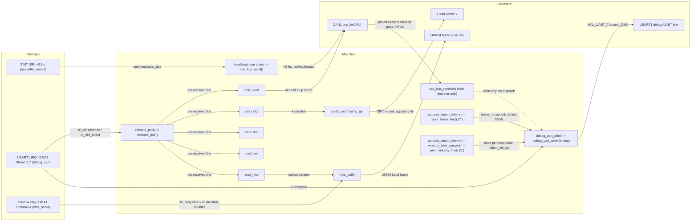

# Wheel Firmware — Data Flow

Survey of `firmware/projects/RobertUN_ModuleNode/Core/{Inc,Src}` (all application `.c`/`.h`
files plus `main.c`, `stm32f4xx_it.c`). Split into two diagrams because the
combined graph was too crowded: **control path** (encoder → velocity → drive →
PWM → current sense, plus the safety loops) and **command/telemetry path**
(console/CAN in main loop, `T,`/`V,` telemetry out).

## Control path

```mermaid
flowchart LR
    subgraph HW["Hardware"]
        TIM2CNT["TIM2 quadrature counter"]
        PWMOUT["TIM4 CH1/CH2 PWM to DRV8874"]
        ADCTRIG["TIM4 CH4 compare, ADC trigger"]
        ADC1["ADC1 IPROPI conversion"]
        DAC1["DAC1_OUT1 VREF trip level"]
        NFAULT["DRV8874 nFAULT pin"]
    end

    subgraph INT["Interrupts"]
        TIM6ISR["TIM6 ISR, dispatches 1 kHz tick"]
    end

    subgraph TICK["1 kHz tick (inside TIM6 ISR)"]
        ENCTICK["encoder_on_tick()"]
        DRVTICK["drive_on_tick()"]
        VELTICK["velocity_on_tick()"]
        RAMP["ramp_step() / emit() / apply()"]
        PLACETRIG["place_trigger()"]
        WDDRV["drive watchdog decrement"]
        WDVEL["velocity setpoint watchdog decrement"]
    end

    subgraph MAIN["Main loop"]
        CMDSET["cmd_drv / cmd_vel setters"]
        ISNSTRIP["isense_set_trip_ma()"]
        ISREAD["isense_read_avg / isense_read_sync_avg"]
    end

    TIM2CNT -->|"continuous, HW quadrature"| ENCTICK
    TIM6ISR -->|"1 kHz"| ENCTICK
    TIM6ISR -->|"1 kHz, after encoder"| DRVTICK
    TIM6ISR -->|"1 kHz, after drive"| VELTICK
    ENCTICK -->|"50 Hz (every 20th tick), rpm+seq"| VELTICK
    VELTICK -->|"50 Hz, PID out_pm"| RAMP
    RAMP -->|"1 kHz ramp step or immediate"| PWMOUT
    RAMP -->|"same call"| PLACETRIG
    PLACETRIG -->|"phase_kind/phase_start"| ISREAD
    PLACETRIG -->|"~20 kHz, once per PWM period"| ADCTRIG
    ADCTRIG -->|"HW event, no IRQ, polled EOC"| ADC1
    ADC1 -->|"raw conversion"| ISREAD
    DRVTICK -->|"1 kHz, wd_remaining=0"| WDDRV
    WDDRV -->|"coast"| RAMP
    VELTICK -->|"1 kHz, independent of 50 Hz step, wd_remaining=0"| WDVEL
    WDVEL -->|"coast + state=TIMEOUT"| RAMP
    NFAULT -->|"async HW assert, sampled 1 kHz"| DRVTICK
    DRVTICK -->|"bridge_ok flag, intra-tick"| VELTICK
    CMDSET -->|"console command, per-mille/gain args"| VELTICK
    CMDSET -->|"console command"| RAMP
    ISNSTRIP -->|"on change, DAC code"| DAC1
    DAC1 -->|"HW comparator"| NFAULT
```

## Command / telemetry path

**Note (confirmed, not a gap):** `can_bus_receive()` is only drained for the
`monitor` print in the main loop — nothing in `Core/` routes a received CAN
frame's id/payload into `velocity`/`drive`/`mks_servo`/`config`. There is no
CAN-RX command path today (confirmed by grepping every `can_bus_receive()`
call site).

**Note:** all application IRQs (TIM6, TIM7, USART1, UART4, their DMA streams)
are configured at equal NVIC priority (0,0) — no priority separation between
the 1 kHz control tick and the UART/DMA interrupts (`stm32f4xx_hal_msp.c`).

## Connection table

| Source | Destination | Trigger / rate | Data | Context | file:line |
|---|---|---|---|---|---|
| TIM6 (base timer) | `HAL_TIM_PeriodElapsedCallback` | HW IT, 90 MHz/(89+1)/(999+1) = 1.000 kHz exact | tick event | ISR (TIM6_DAC_IRQn) | main.c:612-643 |
| TIM7 (base timer) | `HAL_TIM_PeriodElapsedCallback` | HW IT, ~2 Hz (unverified exact value) | tick event, LED toggle | ISR (TIM7_IRQn) | main.c:653-681 |
| TIM6 callback | `encoder_on_tick()` | every 1 kHz tick | none (reads TIM2->CNT) | ISR | main.c:847-852, encoder.c:69 |
| TIM6 callback | `drive_on_tick()` | every 1 kHz tick, after encoder | none | ISR | main.c:854-858, drive.c:544 |
| TIM6 callback | `velocity_on_tick()` | every 1 kHz tick, last | none | ISR | main.c:860-867, velocity.c:233 |
| TIM7 callback | `heartbeat_due = true`, LED toggle | ~0.5 s tick | flag only | ISR | main.c:843-845 |
| TIM2 (HW quadrature) | encoder `prev_count`/CNT read | continuous, x4 quadrature, no IRQ | 32-bit free-running count | HW counter, sampled by ISR | encoder.c:71,76 |
| `encoder_on_tick()` | position/last_delta/ticks | every 1 kHz tick | signed delta counts | ISR | encoder.c:76-81 |
| `encoder_on_tick()` | rpm/vel_seq | every 20th tick = 50 Hz | counts/window → rpm | ISR | encoder.c:86-95 |
| `velocity_on_tick()` | `encoder_velocity_seq()` poll | every 1 kHz tick, steps only on seq change (50 Hz) | uint32 seq compare | ISR | velocity.c:284-289 |
| `velocity_on_tick()` PID | `out_pm` | each 50 Hz step | ff+p+i-d clamped to `ceiling_pm()` | ISR | velocity.c:343-407 |
| `velocity_on_tick()` | `drive_set_duty(out_pm)` | 50 Hz, only if bridge_ok | int16 per-mille | ISR | velocity.c:408, drive.c:356 |
| `drive_set_duty()` | target/applied_mpm/`emit()` | on call (ISR at 50 Hz, or console) | clamped per-mille duty | ISR or main loop | drive.c:356-406 |
| `emit()`/`ramp_step()` | `apply()` → TIM4 CCR1/CCR2 | 1 kHz ramp step or immediate | PWM compare values | ISR or main loop | drive.c:465-507,314-354,81-85 |
| `emit()` | `place_trigger()` → TIM4 CCR4 | same as above | ADC trigger tick placement | ISR or main loop | drive.c:129-203 |
| TIM4 CH4 compare | ADC1 EXTSEL trigger | HW, once per PWM period (~20 kHz) when armed | conversion start pulse | HW, no IRQ (polled EOC) | isense.c:179-197,406-433 |
| `velocity_on_tick()` | `publish()` | every 50 Hz step | full `velocity_sample_t` | ISR | velocity.c:142-171 |
| `console_report_telem()` | `velocity_take_sample()` → `print_velocity_line()` ("V,") | once per pass when telem_vel_on | `velocity_sample_t` | main loop | console.c:2566-2574,2078-2091 |
| `console_report_telem()` | `print_telem_line()` ("T,") | telem_ms period, default 20 ms / 50 Hz (10-100 Hz configurable) | duty,count,rpm,mA,flags | main loop | console.c:2550,2011-2041,2093-2192 |
| print functions | `debug_uart_printf` → `debug_uart_write` (tx ring) → `HAL_UART_Transmit_DMA` | per line | ASCII CSV bytes | main loop enqueue, DMA async send | debug_uart.c:93-121,69-91 |
| UART4 IRQ/DMA1 Stream2,4 | `mks_on_tx_complete`/`mks_on_rx_event` | HW IT, 38400 baud | tx_busy flag; RX via DMA counter | ISR | stm32f4xx_it.c:212-235, uart_events.c:43-81, mks_servo.c:738-757 |
| USART1/DMA2 Stream2,7 | `debug_uart_on_tx_complete`/`on_rx_event`/`on_error` | HW IT, 115200 baud, RX DMA circular + IDLE detect | tx_tail advance; rx_idle_event; error stats | ISR | stm32f4xx_it.c:240-320, uart_events.c:43-102, debug_uart.c:188-341 |
| `console_poll()` | `execute_line()` → `commands[]` dispatch | per received line (idle-terminated or CR/LF) | argv tokens | main loop | console.c:2334-2388,2232-2251 |
| `cmd_drv` | drive setters (duty/enable/brake/coast/limit/ramp/timeout/decay) | on "drv ..." | per-mille/ms/mode args | main loop | console.c:769-1380 (drive.c) |
| `cmd_vel` | velocity setters (enable/setpoint/kp/ki/kd/slew/timeout) | on "vel ..." | mrpm/gain args | main loop | console.c:1406-1530,1854-1870 |
| `cmd_mks` | mks_servo move/enable/request/stop | on "mks ..." | motion params | main loop | console.c:465-620 |
| `cmd_cfg` | `config_set`/`config_get` (flash record) | on "cfg <key> <val>"/"save" | int32 key/value | main loop | console.c:1696-1810, config.c:537-542 |
| `cmd_send` | `can_bus_send()` | on "send <id> [hex]" | up to 8-byte CAN frame | main loop | console.c:372-404, can_bus.c:139-177 |
| main loop | `can_bus_send(dipsw_can_id(), heartbeat)` | ~2 Hz (TIM7 tick), if heartbeat enabled | tec/rec/lec/seq payload | main loop | main.c:256-297 |
| main loop | `can_bus_receive()` drain → `debug_uart_printf` (monitor) | polled every pass, FIFO0 3-deep, not IRQ-driven | raw CAN frame | main loop | main.c:304-317, can_bus.c:220-250 |
| `drive_on_tick()` watchdog | `drive_coast()` | wd_remaining=0, 1 kHz decrement | none | ISR | drive.c:549-561,525-537 |
| `velocity_on_tick()` watchdog | `drive_coast()`, state=VELOCITY_TIMEOUT | wd_remaining=0, 1 kHz decrement (independent of 50 Hz step) | none | ISR | velocity.c:249-279 |
| `ramp_step()` | slew-limited duty | 1 kHz, steps applied_mpm by ramp_pmps/1000 | int32 milli-per-mille accumulator | ISR | drive.c:465-507 |
| DRV8874 nFAULT pin | `drive_faulted()`/fault_latched | sampled every 1 kHz tick; async HW assert | bool + latched duty/ticks | ISR | drive.c:539-542,568-582 |
| `isense_set_trip_ma()` | DAC1_OUT1 (VREF) → HW comparator → nFAULT | on cfg/init/console change only, not per-tick | DAC code (0-4095) | main loop | isense.c:511-547 |
| `drive_faulted()`/`drive_slewing()` | velocity.c anti-windup freeze | every 50 Hz step, same ISR invocation | bool bridge_ok/freeze | ISR (intra-tick) | velocity.c:378-394, drive.c:418-421,539 |
| dipsw latch (boot) | `dipsw_can_id()`/`dipsw_valid()` → heartbeat gate | boot-time latch only | 3-bit ID | main loop | dipsw.c:78-101, main.c:282-283 |

## Shared ISR / main-loop variables

| Variable | file:line | volatile | Written in / read in |
|---|---|---|---|
| `heartbeat_due` | main.c:72 | yes | written TIM7 ISR (main.c:845) / read+cleared main loop (main.c:256-260) |
| encoder `position`, `last_delta`, `ticks`, `rpm`, `window_counts`, `window_ticks` | encoder.c:17-25 | yes | written TIM6 ISR (`encoder_on_tick`) / read via accessors from main loop |
| drive `target`, `applied_mpm`, `ramp_pmps`, `ramp_floor` | drive.c:33-36 | yes | written from main loop (console) and ISR (`ramp_step`) / read both |
| drive `fault_latched`, `fault_ticks`, `fault_duty` | drive.c:44-46 | yes | written TIM6 ISR (`drive_on_tick`) / read main loop (console) |
| drive `wd_period_ms`, `wd_remaining`, `wd_expired` | drive.c:50-52 | yes | written main loop (set/kick) + decremented in ISR / read both |
| velocity `armed`, `state`, `target_mrpm`, `sp_rpm`, `meas_rpm`, `integ`, `d_state`, `prev_meas`, `have_prev`, `out_pm`, `t_ff/p/i/d`, `saturated`, `coasting`, `last_seq`, `period_us`, `pub*`, `step_index`, `wd_*` | velocity.c:49-84 | yes | written TIM6 ISR (`velocity_on_tick`) / read main loop (console, `velocity_take_sample()`) |
| debug_uart `tx_head`, `tx_tail`, `tx_inflight`, `tx_busy` | debug_uart.c:44-47 | yes | tx_head written main loop; tx_tail/tx_inflight/tx_busy written in USART1 TX-complete ISR / read both |
| debug_uart `rx_tail`, `rx_running`, `rx_idle_event` | debug_uart.c:51-53 | yes | rx_idle_event set in RX-event ISR; rx_tail owned by main loop; rx_running written by both |
| mks `tx_busy`, `rx_tail`, `rx_running`, `state` | mks_servo.c:84,87,88,96 | yes | tx_busy cleared in UART4 TX-complete ISR (mks_servo.c:740) / set+read in main loop (`mks_poll`) |
| drive `duty` | drive.c:17 | **no** | written in ISR (`ramp_step`→`emit`, drive.c:465-507/314-354, and `drive_coast()` from ISR watchdog, drive.c:534) **and** main loop (`drive_set_duty`/`drive_brake`/`coast` via console) / read main loop via `drive_duty()`. No volatile qualifier and no comment justifying the absence, unlike the slew-limiter block just above it. |
| drive `limit` | drive.c:18 | no | written only main loop (`drive_init`/`drive_set_limit`, console) / read in ISR via `ceiling_pm()`→`drive_limit()` inside `velocity_on_tick` (velocity.c:121,127) |
| drive `enabled` | drive.c:20 | no | written only main loop (`drive_enable`/`drive_disable`, console) / read in ISR via `drive_is_enabled()` inside `velocity_on_tick`'s bridge_ok (velocity.c:378) |
| drive `decay` | drive.c:19 | no | written only main loop (`drive_set_decay`, console) / read inside `emit()` when called from ISR (`ramp_step`, drive.c:330-353) |
| drive `phase_ticks`, `phase_start`, `phase_trigger` | drive.c:58-60 | no | written by `place_trigger()` from ISR or main loop / read via accessors from main loop (console, isense sync path) |
| drive `sense_kind`, `sense_first`, `sense_last` | drive.c:65-67 | no | same write path as `phase_*` above / read main loop by `isense_sync_ready()`/`isense_sync_is_decay()` (isense.c:225-250), gating whether telemetry trusts a current reading |
| velocity `kp`/`ki`/`kd`/`ff_slope`/`ff_offset`/`slew_rpm_s`/`i_limit`/`out_max` | velocity.c:30-40 | no | deliberately non-volatile per explicit code comment (velocity.c:25-28) arguing single-word console writes and one-step-stale ISR reads are acceptable — see Unverified |

## Unverified

- `velocity.c` gains (`kp`/`ki`/`kd`/`ff_slope`/`ff_offset`/`slew_rpm_s`/`i_limit`/`out_max`, velocity.c:30-40) are non-volatile by an explicit in-code rationale (velocity.c:25-28: single-word console writes, one-step-stale ISR reads acceptable). The survey confirmed the code states this rationale, not that it holds under all compilers/optimization levels.
- Exact TIM7 heartbeat period: computed from register values (prescaler 1800, period 25000, APB1 timer clock) as ~0.5 s; not confirmed by a bench measurement or a printed value in the source.
