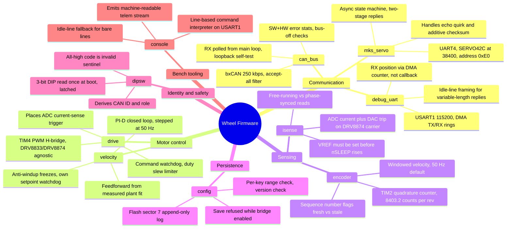

# Wheel Firmware — Module Map

Survey of the application modules in `firmware/RobertUN_ModuleNode/Core/Inc`
(HAL vendor headers excluded), cross-checked against the firmware-modules
section of `PROJECT_CONTEXT_WHEEL_FW_REF_MCU.md`.

## Module list

| Module | Category | Key characteristics |
|---|---|---|
| `can_bus` | Communication | bxCAN on CAN1 @ 250 kbps, accept-all filter; SW stats (tx/rx, dropped, overruns) plus HW TEC/REC/LEC; RX polled from main loop, loopback self-test |
| `debug_uart` | Communication | Non-blocking DMA on USART1, 115200 8N1; RX write position read from DMA counter, not a callback; idle-line framing delimits variable-length replies |
| `mks_servo` | Communication | UART4 driver for SERVO42C, 38400 baud, fixed address 0xE0; async ST_TX/ST_WAIT_REPLY/ST_WAIT_MOTION state machine; handles echo-of-request quirk and additive checksum |
| `drive` | Motor control (mechanism) | TIM4 PWM H-bridge (DRV8833/DRV8874 agnostic), signed per-mille duty, slow/fast decay; owns command watchdog and duty slew limiter; places ADC current-sense trigger for `isense` |
| `velocity` | Motor control (policy) | PI(D) speed control stepped at 50 Hz from `encoder`; feedforward from measured duty-vs-rpm fit; anti-windup freezes on saturation/slewing/fault, own setpoint watchdog |
| `encoder` | Sensing | TIM2 hardware quadrature, 8403.2 counts/output-rev; windowed velocity (default 50 Hz); sequence number distinguishes fresh vs stale reads |
| `isense` | Sensing / safety | ADC current sense + DAC current-limit trip on modified DRV8874 carrier; free-running vs phase-synchronised read paths; VREF must be set before nSLEEP rises (fail-safe) |
| `config` | Persistence | Tunables persisted in flash, editable from console; append-only log in sector 7 (~1024 saves before erase), CRC-checked; per-key range/version check, save refused while bridge enabled |
| `dipsw` | Identity / safety | 3-bit DIP read once at boot and latched; derives CAN ID and role; all-high code is a deliberate invalid sentinel, gates bus join |
| `console` | Bench tooling / HMI | Line-based command interpreter on USART1 (`send`, `drv`, `cfg`, `mks`, `telem`, …); idle-line fallback for bare lines; emits machine-readable `telem` stream |

CubeMX-generated glue (`main`, `stm32f4xx_it`, `stm32f4xx_hal_conf`) is board
entry point / HAL config / interrupt table — not an application module, no
distinct characteristics.
