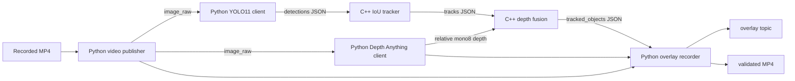

# Pre-ZED Perception Delivery

This directory contains the camera-less implementation of the perception
project. The original plan uses a ZED 2i, but the camera was not used anywhere
in this workflow. Recorded MP4 files provide repeatable input while the rest of
the detection, tracking, depth fusion, and visualization path runs through
ROS 2.

The result is suitable for demonstrating the software architecture before
camera integration. It reports **relative monocular depth**, not distance in
meters.

## Data flow



Detailed node and topic behavior is in
[`docs/architecture.md`](docs/architecture.md). Reported evidence and pending
checks are in [`docs/validation.md`](docs/validation.md).

## Prerequisites

- ROS 2 Humble and `colcon`
- The two packages in `ros2_ws/src/`
- OpenCV available to the Python interpreter used by ROS 2
- A local Roboflow Inference Server at `http://localhost:9001`
- Access to `depth-anything-v3/small` and `yolov11n-640`
- MP4 input files under
  `datasets/depth_anything_v3_small/input_videos/`

Keep credentials outside the repository:

```bash
export ROBOFLOW_API_KEY='your_api_key'
```

The `api_key` parameters in
[`configs/pre_zed_params.yaml`](configs/pre_zed_params.yaml) intentionally stay
empty. Never commit the key.

## Build

These examples use `zsh`, which is the shell used on the project machine:

```zsh
cd /home/ingfisica/RobertUN/jetson_ros2/ros2_ws
source /opt/ros/humble/setup.zsh

colcon build --symlink-install \
  --packages-select pre_zed_perception_py pre_zed_tracking_cpp

source install/setup.zsh
```

Use the matching `.bash` setup files from a Bash shell. Do not source a Bash
setup file from Zsh.

## Check the finite workflow first

The shortest dataset video is `humanoidrobot.mp4`. A sampled run is useful for
checking communication and MP4 finalization before spending time on every
frame:

```zsh
cd /home/ingfisica/RobertUN/jetson_ros2

python3 final_preZED/scripts/run_pre_zed_single_video.py \
  --frame-stride 30 \
  --completion-timeout 45 \
  --output final_preZED/outputs/humanoidrobot_smoke_overlay.mp4
```

This processes about ten frames and stores them at about 1 FPS. The resulting
video is intentionally sampled, so it looks slow and must not be described as
a complete-frame result.

A validation run completed a ten-frame sampled output. A later complete-frame
attempt exposed dropped source delivery and stopped early. The source and
required subscribers were changed to reliable QoS after that test; a new
complete run is still required to validate that revision.

## Process every frame of one video

After the sampled output is correct, run the same workflow with the default
`frame_stride=1`:

```zsh
python3 final_preZED/scripts/run_pre_zed_single_video.py \
  --completion-timeout 150 \
  --output final_preZED/outputs/humanoidrobot_full_overlay.mp4
```

The command stays in the foreground until every frame is processed or an
error occurs. Processing is much slower than playback because each frame waits
for both HTTP inference branches and the final synchronized overlay. The MP4
is written at the source FPS, so a successfully completed result should play
at normal source speed.

The runner checks that the result:

- can be decoded by OpenCV
- contains approximately the expected number of frames
- keeps the source width and height
- uses the expected playback FPS

It refuses to replace an existing output unless `--overwrite` is supplied.

## Process all dataset videos

First inspect the workload. A dry run reads video metadata and prints the
order, expected output names, and estimated runtime; it does not start ROS 2
or inference:

```zsh
python3 final_preZED/scripts/run_pre_zed_all_videos.py --dry-run
```

After one complete single-video run passes, start the full batch:

```zsh
python3 final_preZED/scripts/run_pre_zed_all_videos.py \
  --completion-timeout 150
```

The batch runs the shortest videos first and writes one independent file per
input under `final_preZED/outputs/all_videos/`. It validates each file before
continuing. Existing files that pass the same mechanical checks are skipped.

Useful controls are:

- `--overwrite`: replace outputs deliberately
- `--continue-on-error`: continue after a failed video
- `--frame-stride N`: create sampled previews rather than complete outputs
- `--input-dir` and `--output-dir`: use different dataset locations

The existence of an MP4 alone is not evidence that the whole workflow passed.
Keep the runner's final validation output with any result used in a report.

## Looping demonstration

The looping command is useful for inspecting live ROS topics. It does not end
at the last video frame; stop it with `Ctrl+C`:

```zsh
bash final_preZED/scripts/run_pre_zed_demo.sh
```

It uses the default video and output path from the YAML configuration. Use the
finite runner when the goal is a complete, finalized recording.

## Inspect ROS 2 output

While the looping pipeline is running, use a second terminal:

```zsh
cd /home/ingfisica/RobertUN/jetson_ros2
source /opt/ros/humble/setup.zsh
source ros2_ws/install/setup.zsh

ros2 topic list --no-daemon --spin-time 10 -t
ros2 topic echo --no-daemon --spin-time 10 \
  /tracked_objects std_msgs/msg/String --once --full-length
```

Expected project topics are:

- `/prezed/image_raw`
- `/prezed/depth/relative_image`
- `/prezed/depth/visualization`
- `/prezed/detections`
- `/prezed/tracks`
- `/tracked_objects`
- `/prezed/overlay`

Every fused record must contain `"depth_is_metric": false`.

## Detection scope

The configuration uses `yolov11n-640`, a confidence threshold of `0.60`, and
an allowlist for people, road vehicles, and COCO animal classes. This removes
low-confidence and unrelated detections before tracking.

COCO contains `person`, common vehicles, and several animal classes. It does
not contain exact `humanoid`, `lion`, or `buffalo` labels. A humanoid may be
detected as `person`, but reliable lion and buffalo names require a detector
trained for those classes.

## Folder contents

- `configs/`: explicit ROS 2 parameters for all six nodes
- `docs/`: architecture and validation status
- `outputs/`: ignored runtime MP4 files
- `scripts/`: looping, finite single-video, and batch entry points

## Boundaries of this delivery

- No ZED image, stereo depth, IMU, TF, or point cloud is used.
- Relative depth is normalized independently for each frame and is not meters.
- The IoU tracker can switch IDs during fast motion, overlap, or occlusion.
- HTTP inference is not real time in the measured configuration.
- `/tracked_objects` is a temporary JSON string contract.
- Full-video and all-video validation must be repeated after the latest source
  QoS correction.

The camera migration steps are recorded in [`../plan.md`](../plan.md) and in
the final section of [`docs/architecture.md`](docs/architecture.md).
